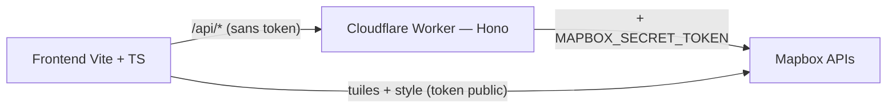

# Mapbox 3D — Carte photoréaliste

Application web démontrant une carte Mapbox 3D photoréaliste avec :
- Recherche autocomplete (forward geocoding)
- Reverse geocoding au clic
- 4 presets lumineux (dawn / day / dusk / night) + mode **Auto** suivant l'heure locale
- **URL partageable** + **favoris** persistés
- **Itinéraires** Directions API avec camera follow cinématique
- **Recherche par catégorie** (Restaurants, Hôtels, Cafés, Musées, Parcs)
- **Isochrones** 10/20/30 min
- **Story mode** scrollytelling — 6 chapitres scénarisés à Paris (avec orbites cinématiques)
- **i18n FR/EN** + accessibilité (skip-link, ARIA combobox, focus-visible, `prefers-reduced-motion`)

Build portfolio-grade : TypeScript strict, tests Vitest + Playwright, CI GitHub Actions, proxy Cloudflare Worker pour ne plus exposer le token côté client.

## Stack

**Frontend** (`/`)
- **Vite 8** + **TypeScript strict** (`noUncheckedIndexedAccess`, `exactOptionalPropertyTypes`, `verbatimModuleSyntax`)
- **Mapbox GL JS v3** — carte 3D, style Standard photoréaliste
- **Vitest** + **happy-dom** — tests unitaires (77 tests)
- **Playwright** — E2E (déclenchement manuel pour préserver le quota)
- **ESLint** flat config TS-aware
- Aucun framework UI (DOM vanilla + helper `h()` maison)

**Backend** (`/server`)
- **Cloudflare Worker** + **Hono** — proxy `/api/*` vers Mapbox
- Endpoints : `search`, `retrieve/:id`, `reverse`, `category/:id`, `directions`, `isochrone`
- CORS allowlist via env, rate limit IP sliding-window, cache 30-60s

## Architecture v2



```
mapbox-3d-photorealistic/
├── src/
│   ├── main.ts                  # init carte 3D, contrôles, click→reverse
│   ├── geocoding.ts             # client du proxy /api/*
│   ├── search.ts                # autocomplete debounced + flyTo
│   ├── search-categories.ts     # chips POI
│   ├── directions.ts            # waypoints + line layer + camera follow
│   ├── isochrone.ts             # zones temps 10/20/30 min
│   ├── light-preset.ts          # bascule dawn/day/dusk/night (controller)
│   ├── light-preset-auto.ts     # mode Auto (heure locale → preset)
│   ├── url-state.ts             # hash <-> état carte
│   ├── favorites.ts             # store + types
│   ├── favorites-ui.ts          # drawer panneau
│   ├── story.ts                 # scrollytelling 6 chapitres + orbites
│   ├── i18n/{fr,en,index}.ts    # dictionnaires + helper t()
│   ├── i18n-ui.ts               # static text translation + lang switcher
│   ├── ui/{panel,toast}.ts      # helpers DOM
│   ├── utils/{geo,motion}.ts    # bearing, format, prefers-reduced-motion
│   ├── types/mapbox.ts          # types API Mapbox
│   └── styles.css
├── stories/paris.json           # script narratif Story mode
├── tests/
│   ├── unit/                    # Vitest (8 fichiers, 77 tests)
│   ├── e2e/                     # Playwright (recherche Tour Eiffel)
│   └── setup.ts                 # polyfill localStorage pour happy-dom
├── server/
│   ├── src/index.ts             # Worker Hono
│   ├── wrangler.toml
│   └── tsconfig.json
├── .github/workflows/{ci,e2e}.yml
├── tsconfig.json
├── vite.config.ts
├── vitest.config.ts
├── playwright.config.ts
├── eslint.config.js
├── CHANGELOG.md
└── README.md
```

## Installation

```bash
# Frontend
npm install

# Worker proxy
npm --prefix server install
```

### Configuration des tokens

L'app utilise **deux tokens distincts** :

1. **`VITE_MAPBOX_PUBLIC_TOKEN`** — embarqué dans le bundle pour mapbox-gl (carte/tuiles/style). À protéger via URL allowlist sur ton compte Mapbox.
2. **`MAPBOX_SECRET_TOKEN`** — utilisé uniquement par le Worker, jamais exposé au navigateur. Sert pour Search Box, Geocoding v6, Directions, Isochrone, Category.

```bash
# Frontend
cp .env.example .env
# Éditer .env :
#   VITE_MAPBOX_PUBLIC_TOKEN=pk.xxx

# Worker
cp server/.dev.vars.example server/.dev.vars
# Éditer server/.dev.vars :
#   MAPBOX_SECRET_TOKEN=pk.xxx (peut être le même token, idéalement séparé en prod)
```

⚠️ **Sécurité du token public** : avant d'exposer ton domaine en prod, restreins le token public via [URL allowlist](https://docs.mapbox.com/accounts/guides/tokens/#url-restrictions) :
- `http://127.0.0.1:5173/*`, `http://localhost:5173/*` (dev)
- `https://*.pages.dev/*` (preview Cloudflare Pages)
- Ton domaine prod

Sans allowlist, ce token peut être recopié et utilisé sur d'autres sites — facturation à ton compte.

## Développement

Lancer **les deux** processus en parallèle (deux terminaux) :

```bash
# Terminal 1 — Worker (port 8787)
npm run dev:server

# Terminal 2 — Vite (port 5173, proxie /api → :8787)
npm run dev
```

Ouvrir [http://127.0.0.1:5173](http://127.0.0.1:5173).

## Commandes

| Commande | Effet |
|---|---|
| `npm run dev` | Vite dev server (5173) |
| `npm run dev:server` | Worker dev (wrangler, 8787) |
| `npm run build` | Build prod |
| `npm run preview` | Preview du build prod |
| `npm run typecheck` | `tsc --noEmit` |
| `npm run lint` | ESLint |
| `npm test` | Tests unitaires (Vitest) |
| `npm run test:cov` | Couverture |
| `npm run test:e2e` | Tests E2E Playwright (nécessite token + dev server) |
| `npm --prefix server run typecheck` | Typecheck Worker |
| `npm --prefix server run deploy` | Deploy Worker (`wrangler deploy`) |

## CI

- [.github/workflows/ci.yml](.github/workflows/ci.yml) : typecheck + lint + test + build (frontend & server) à chaque push / PR
- [.github/workflows/e2e.yml](.github/workflows/e2e.yml) : déclenchement manuel (`workflow_dispatch`), Playwright en chromium. Token via secret `MAPBOX_E2E_TOKEN`.

## Test manuel

1. **Recherche** : taper « Tour Eiffel » → flyTo 5s vers Paris en 3D (vérifier en DevTools Network qu'aucun appel direct à `api.mapbox.com` pour le geocoding — tout passe par `/api/search`)
2. **Reverse** : clic sur la carte → popup adresse
3. **Light presets** : cycler dawn/day/dusk/night → ambiance change, persistance après reload
4. **Auto preset** : clic « Auto » → suit l'heure locale du centre carte. Pan vers Tokyo → bascule en `night`
5. **URL state** : modifier la vue → URL met à jour après ~500ms ; bouton partage → toast « Lien copié » ; coller l'URL en privé → vue restaurée
6. **Favoris** : étoile → drawer → « Notre-Dame » + Entrée → sauvegardé. Aller / Renommer / Supprimer.
7. **Itinéraires** : toggle → cliquer 2 points en mode 🚴 → tracé + durée/distance ; bouton « Suivre l'itinéraire » → caméra glisse 10s
8. **Catégories** : chip « Cafés » → markers ☕ apparaissent
9. **Isochrones** : toggle « Combien de temps ? » → click carte → 3 polygones concentriques
10. **Story** : ▶️ → 6 chapitres scénarisés. Chapitre 5 (Tour Eiffel dusk) → orbite 14s + ciel rose. Esc → retour à l'état initial.
11. **i18n** : switcher FR/EN → tous les textes UI changent
12. **A11y** : Tab depuis le top → skip-link visible. `prefers-reduced-motion` (DevTools → Rendering) → flyTo devient instantané, orbites désactivées.

## Vérifier le MCP Mapbox (côté Claude Code)

```bash
claude mcp list | grep geocoding
# → geocoding: https://mcp.mapbox.com/mcp (HTTP) - ✓ Connected
```

Le MCP n'est pas appelable depuis le navigateur — il sert uniquement au diagnostic pendant le développement (validation des endpoints, tests d'intégration manuels).

## Roadmap

Idées non retenues pour 2.0 mais pertinentes :
- Heatmap upload CSV
- Mesure distance entre deux points cliqués
- Comparaison split-screen (deux vues côte-à-côte)
- PWA installable + service worker (`vite-plugin-pwa`)
- Déploiement Cloudflare Pages + Worker

## Dépannage

| Symptôme | Cause probable | Fix |
|---|---|---|
| Écran « Token Mapbox manquant » | Pas de `.env` ou clé fausse | `cp .env.example .env`, ajouter `VITE_MAPBOX_PUBLIC_TOKEN=pk.xxx` |
| Écran « Token Mapbox invalide » | Token expiré ou faux | Régénérer sur [account.mapbox.com](https://account.mapbox.com/access-tokens/) |
| 401 sur `/api/*` | `MAPBOX_SECRET_TOKEN` absent côté Worker | Créer `server/.dev.vars` |
| 403 sur `/api/*` | Origin pas dans allowlist | Ajuster `ALLOWED_ORIGINS` dans `server/wrangler.toml` |
| 429 trop tôt | Rate limit Worker | Ajuster `RATE_LIMIT_PER_SECOND` ou désactiver en dev |
| Suggestions vides | Quota Mapbox dépassé / token sans scope | Vérifier le compte |
| Les bâtiments 3D ne s'affichent pas | Pitch trop bas | Augmenter le pitch (≥ 60°) avec la boussole |

## Licence

Privé.
